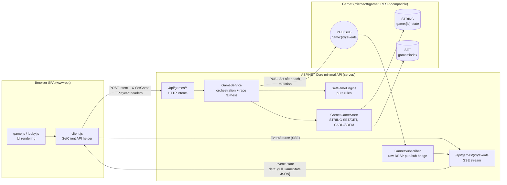
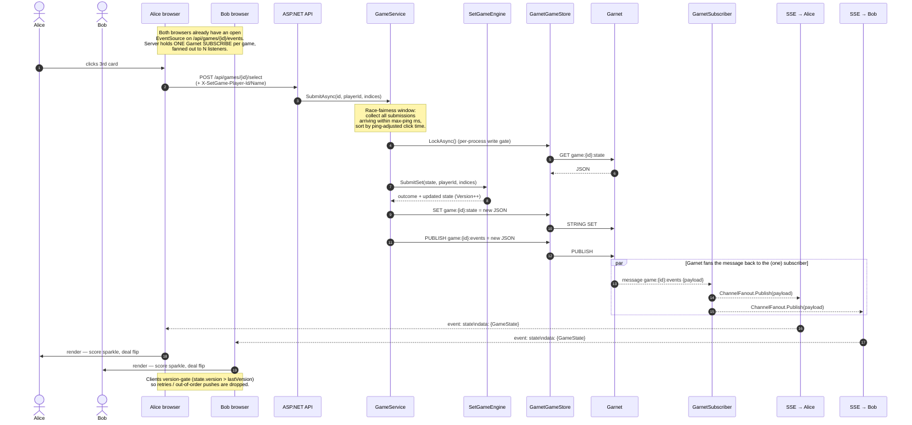
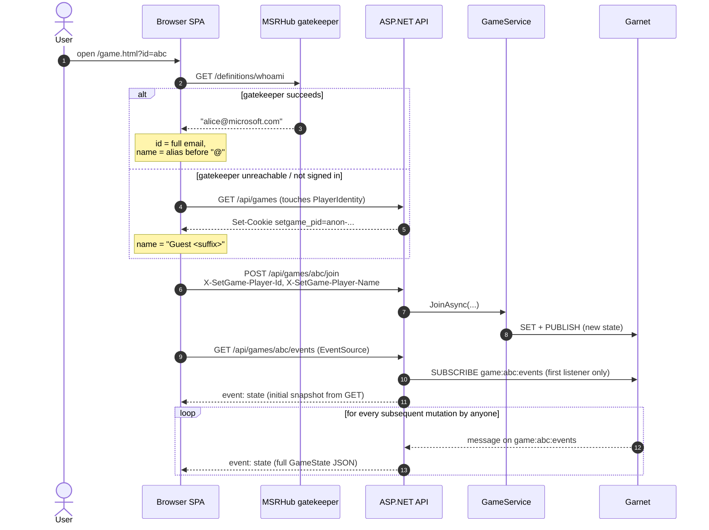
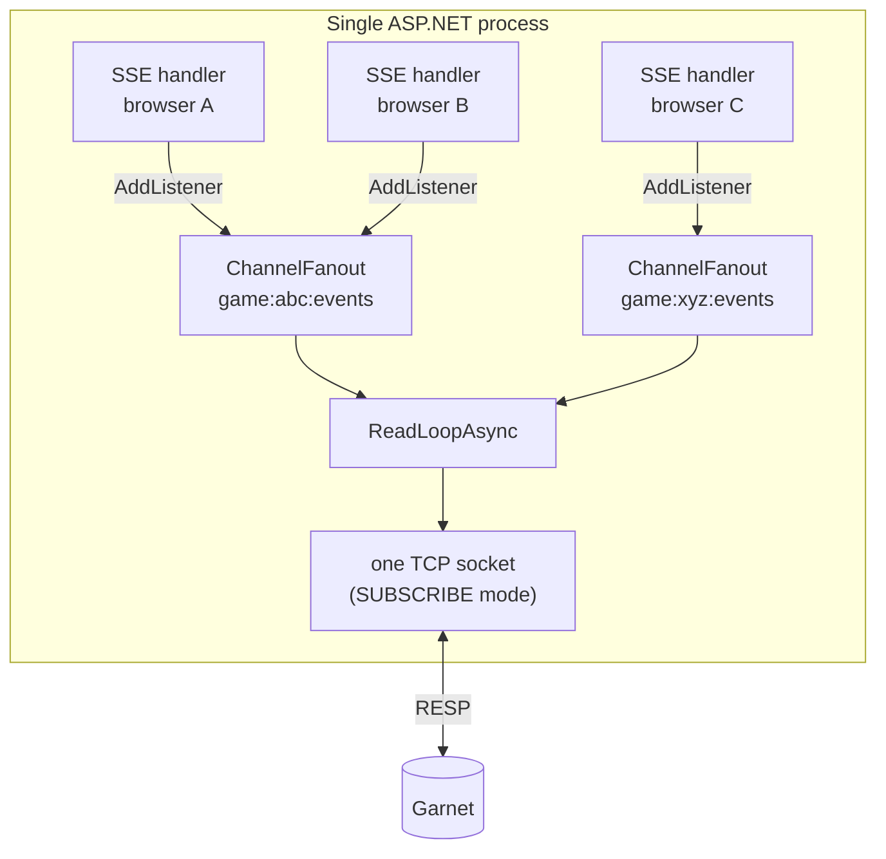
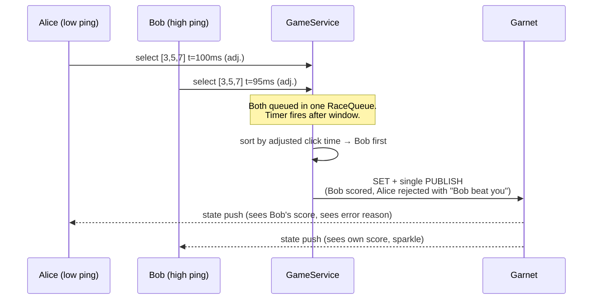

# SetGame Architecture

A multiplayer Set card game with **server‑authoritative state** and
**Garnet** as the only persistence + real‑time fan‑out layer. The browser
is a thin SPA: it POSTs intents (join, select, hint, …) and reflects
state pushed back to it over Server‑Sent Events (SSE).

The whole real‑time loop is just **two Garnet primitives** per game:

| Concern              | Garnet primitive          | Key / channel              |
| -------------------- | ------------------------- | -------------------------- |
| Game state blob      | `STRING` (JSON)           | `game:{id}:state`          |
| Lobby index          | `SET`                     | `games:index`              |
| Real‑time fan‑out    | `PUBLISH` / `SUBSCRIBE`   | `game:{id}:events`         |

Every state mutation is **`SET ... ; PUBLISH ...`** under a per‑process
write lock — so persistence and broadcast are produced from the same
in‑memory object, and every connected client sees the same authoritative
snapshot.

---

## High‑level component diagram



Every browser holds **one EventSource per game**. The server holds **one
Garnet subscription per game**, multiplexed across all connected
browsers via an in‑process fan‑out (`ChannelFanout`).

---

## Real‑time write/broadcast loop

The interesting story is what happens when *anyone* does anything in a
game — say Alice clicks "submit a set".



### Why publish *after* setting the same JSON we just stored?

Because the SSE handler subscribes to `game:{id}:events` and treats every
published payload as *the* new authoritative state. There is no separate
"event" model: **the broadcast payload is the full state blob.** That
keeps the protocol trivially recoverable — a freshly opened browser gets
the same `state` event shape from the initial `GET` as it does from
every subsequent `PUBLISH`.

---

## How a browser joins a game



Identity precedence on the server (`PlayerIdentity.From`):

1. `X-SetGame-Player-Id` / `X-SetGame-Player-Name` — supplied by the SPA
   (gatekeeper‑resolved username, URL‑encoded).
2. `X-MS-CLIENT-PRINCIPAL-ID` / `-NAME` — MSRHub auth proxy headers.
3. `setgame_pid` cookie — local‑dev anonymous fallback ("Guest …").

---

## Garnet keys and channels at a glance

```
games:index                          SET     all known game ids (lobby)
game:{id}:state                      STRING  full GameState JSON
game:{id}:events                     PUB/SUB broadcast of every persisted state
```

A single mutation always does, **inside one `LockAsync()`**:

```
GET     game:{id}:state
…mutate in process, bump state.Version, set state.LastActivityAt = now…
SET     game:{id}:state  <new JSON>
PUBLISH game:{id}:events <same new JSON>
```

This is in `GameService.MutateAsync` and is the single chokepoint for
*every* state change (join, leave, submit, hint, deal3, restart,
new‑round, ping). Returning `false` from the mutation callback skips
both the SET and the PUBLISH — used when an action is rejected without
touching state (e.g. losing a race).

---

## Pub/sub bridge: one TCP connection, many subscribers

The high‑level Garnet C# client doesn't expose a SUBSCRIBE callback, so
`GarnetSubscriber` opens a **dedicated TCP connection** in SUBSCRIBE
mode and speaks raw RESP:



* First listener on a channel issues `SUBSCRIBE channel` to Garnet.
* Last listener leaving issues `UNSUBSCRIBE channel`.
* Every incoming `["message", channel, payload]` is dispatched to the
  matching `ChannelFanout`, which writes to each listener's
  `Channel<string>` reader. The SSE handler then formats the payload as
  `event: state\ndata: …\n\n`.

Writes (SET, PUBLISH, SADD, …) go through the **separate**
`GarnetClient` connection in `GarnetGameStore`. Read‑modify‑write is
serialized in the server process by `GarnetGameStore.LockAsync()` —
sufficient because there is exactly one writer process per Garnet
deployment.

---

## Race fairness for simultaneous "set!" submissions

Two players who both spot the same set within milliseconds will arrive
at the server out of order due to network jitter. `GameService` collects
submissions in a short window (sized by the slowest known ping) and
resolves them in **one** `MutateAsync`, so one combined broadcast covers
every set found in that window:



If the two submissions are **disjoint sets**, both are accepted in the
same mutation; the broadcast carries `ScoredPlayerIds[]` and the
combined `LastDealtIndices` so both deals animate together on every
client.

---

## Garbage collection

* **Inactive players** — periodic timer (`SweepInactivePlayersAsync`,
  every 5 s) flips a player to `Active=false` if no `/ping` arrived
  within 30 s. The flip itself goes through `MutateAsync` so every
  client immediately sees the dim row.
* **Stale games** — `SweepStaleGamesAsync` runs every 10 min: any game
  whose `LastActivityAt` is older than 24 h is `DELETE`d from
  `game:{id}:state`, removed from `games:index`, and dropped from
  in‑process race / ping caches.
* **Lobby cap** — `ListAsync` returns at most 1000 games, sorted by
  `StartedAt` descending.

---

## File map

| Layer            | Files                                                            |
| ---------------- | ---------------------------------------------------------------- |
| Rules engine     | `server/Engine/SetGameEngine.cs`, `server/Engine/GameState.cs`   |
| Orchestration    | `server/Games/GameService.cs`, `server/Games/PlayerIdentity.cs`  |
| Garnet wiring    | `server/Garnet/GarnetGameStore.cs`, `server/Garnet/GarnetSubscriber.cs` |
| HTTP / SSE edges | `server/Program.cs`                                              |
| SPA              | `server/wwwroot/js/{client,lobby,game,cards}.js`, `wwwroot/*.html` |
| Container        | `docker-compose.yml` (runs Garnet on `localhost:6379`)           |
